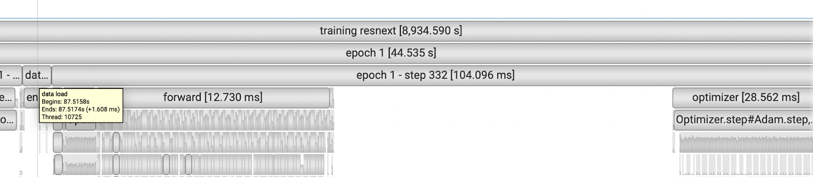
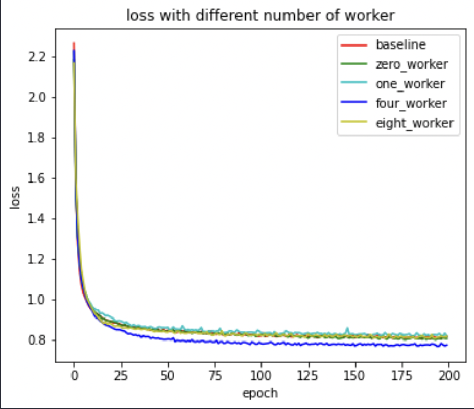
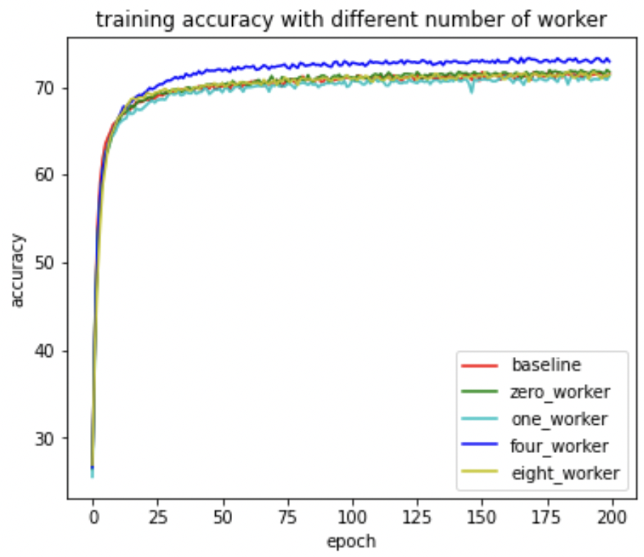
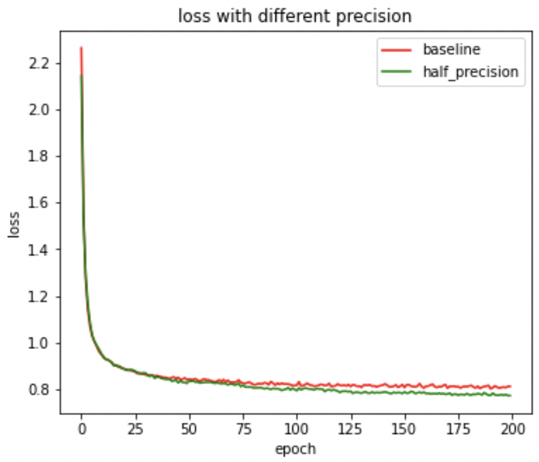
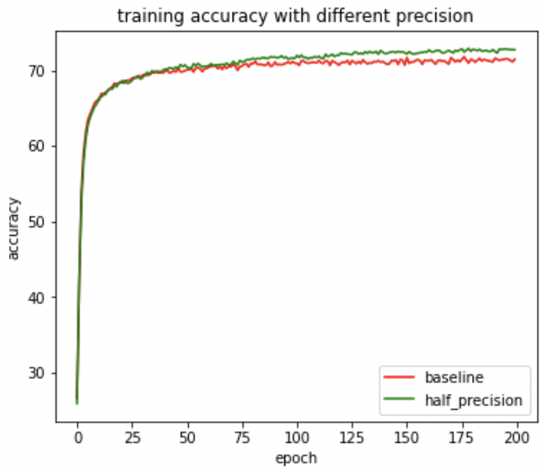
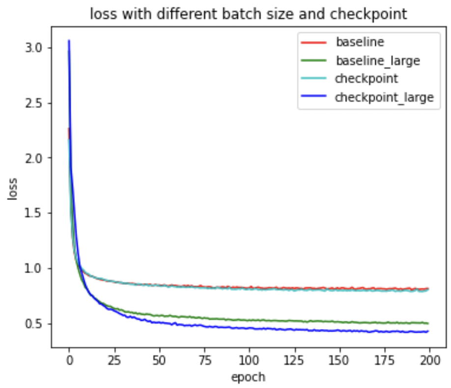
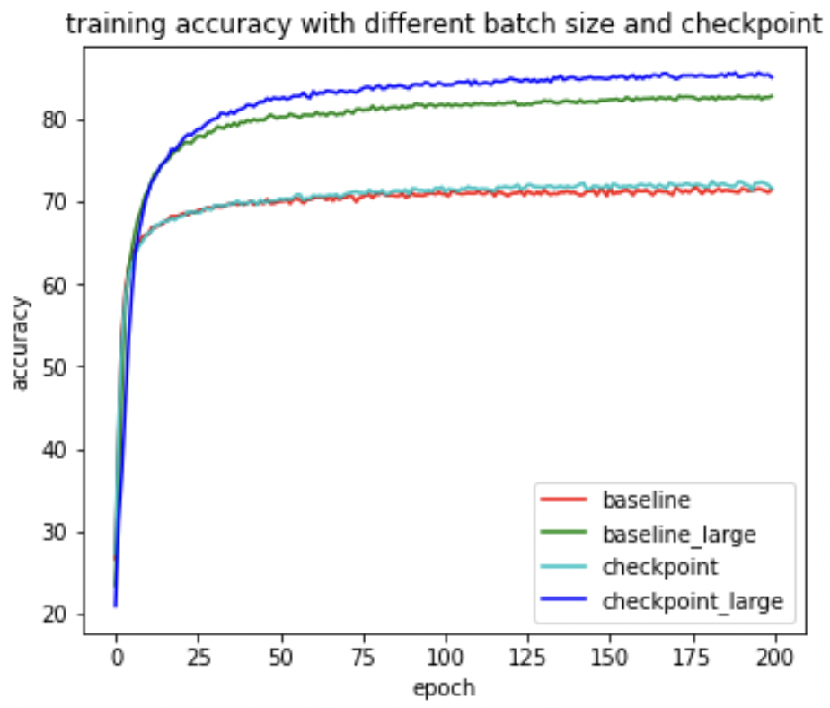
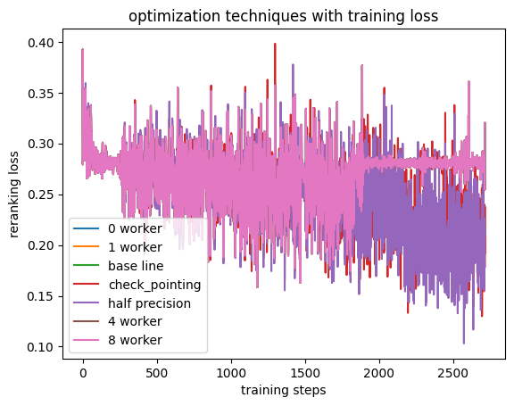

# Optimise-Models

## Overview

This repository aims to apply different optimization techniques to different models. The models we focused on is [ResneXt](https://arxiv.org/abs/1611.05431) and [SimCLS](https://arxiv.org/abs/2106.01890v1). And the optimization techniques are Data loading, Mixed precision and Checkpoint intermediate buffers. 

## Outline of the code respository

The repository contains two folders, [resnext](resnext) cantain all related files to model ResneXt. And [SimCLS](SimCLS) contains the file for SimCLS. 

### ResneXt

The code of ResneXt model in [models](resnext/models) are muldified based on [kuangliu](https://github.com/kuangliu/pytorch-cifar)’s implementation. Experiments are performed using A100 GPU on google cloud platform. Each model is trained for 200 epochs using adam with learning rate 0.01 and batch size 128 unless otherwise specified. The dataset used is cifar10. 

#### Example commands to execute the code

Nvidia Nsight System is used to profiling the training process. 

`nsys profile -t cuda,nvtx --cuda-memory-usage true` is used to trace cuda, nvtx and memory.

Commands used to run the training for resnext can be found [here](resnext/run.sh)

Command to profile the baseline model: `nsys profile -o profile/resnextBaselineProfile --cuda-memory-usage true -t cuda,nvtx --force-overwrite true python3 resnext.py `

[resnext.py](resnext/resnext.py) is the main file used in the experiment. By default, running it without any addition argument will train the baseline model (i.e. 2 worker, single precision, no checkpoint). After training finishes, it will store 2 files, one is the state dict of the trsined model, and the other is the loss, training accuracy and test accuracy per epoch. 

There are several commandline arguments that can be specified when training. 

- `--num_worker` number of worker for data loader, default is 2
- `--half_precision` whether to use half precision
- `--num_epoch` number of training epoch, default is 200
- `--batch_size` training batch size, default is 128
- `--lr` learning rate, default is 0.01

[resnext_checkpoint.py](resnext/resnext_checkpoint.py) is the checkpoint version of previous code. It has the same commandline arguments as [resnext.py](resnext/resnext.py). 


### SimCls

## 1. How to Install

### Requirements
- `python3`
- `conda create --name env --file spec-file.txt`
- `pip3 install -r requirements.txt`
- `compare_mt` -> https://github.com/neulab/compare-mt

### Description of Codes
- `main.py` -> training scorer model
- `model.py` -> models
- `data_utils.py` -> dataloader
- `utils.py` -> utility functions
- `preprocess.py` -> data preprocessing
- `generat_cand.py` -> generate candidate summaries for training
- `finetune_model.py` -> finetune your own generative model
- `evaluate_model.py` -> evalualte model with trained scorer

### Workspace
Following directories should be created for our experiments.
- `./cache` -> storing model checkpoints
## 2. Dataset
Need to know that the dataset in this repo [clean_covid.csv](clean_covid.csv) is just a sample dataset only contain 10000 records, if you want to access to the full data, please refer to the following link.

- [The COVID-19 Open Research Dataset.](https://learn.microsoft.com/en-us/azure/open-datasets/dataset-covid-19-open-research?tabs=azure-storage)

## 3. Generating candidates

To generate candidates please run:
```
!python gen_candidate.py --generator_name {args.generator_name} --dataset_name {args.dataset_name} --dataset_percent {args.dataset_percent} --num_cands {args.num_cands}
```
**generator_name**: is the path to previously finetuned generator. Here in our case we use a T5_small model finetuned on CORD dataset.  
**dataset_name**: is the path to dataset. (need to be a csv file, and column name for source document should be **abstract**, column name for reference summary should be **title**). 
**dataset_percent**: percent of data are used to generate, for test you can use smal percent of dataset to debug. Default to 100.  
**num_cands**: Num of candidates you want to generate.  

Generated candidate are stored in the forder 'candidates/{args.generator_name}_{args.num_cands}'.  

For data preprocessing, please run
```
python preprocess.py --src_dir [path of the raw data] --tgt_dir [output path] --split [train/val/test] --cand_num [number of candidate summaries]
```
`src_dir` is the candidate folder: 'candidates/{args.generator_name}_{args.num_cands}'.

The preprocessing precedure will store the processed data as seperate json files in `tgt_dir`.

## 4. scorer training

### Hyper-parameter Setting
You may specify the hyper-parameters in `main.py`.

### Train
```
python main.py --cuda --gpuid [list of gpuid] -l
```
### Fine-tune
```
python main.py --cuda --gpuid [list of gpuid] -l --model_pt [model path]
```
model path should be a subdirectory in the `./cache` directory, e.g. `cnndm/model.pt` (it shouldn't contain the prefix `./cache/`).

### Evaluate
```
python evaluate_model.py --generator_name {args.generator_name} --dataset_name {args.dataset_name} --scorer_path cache/22-12-17-0/scorer.bin --dataset_percent 10
```


# Results
---

### ResneXt

#### Sample result of profiling



#### data loader

|            | Baseline (2 worker) | 0 worker | 1 worker | 4 worker | 8 worker |
| ---------- | ------------------- | -------- | -------- | -------- | -------- |
| Load time  | 1.6 ms              | 63 ms    | 1.9 ms   | 1.6 ms   | 1.6 ms   |
| Step time  | 104 ms              | 104 ms   | 105 ms   | 104 ms   | 104 ms   |
| Epoch time | 44.5 s              | 67.7 s   | 44.6  s  | 44.7 s   | 44.9 s   |


With 1 worker, loading time is 30 times faster than 0 worker. Only a small improvement in time when increase worker from 1 to 2. No improvements using more than 2 workers.






The loss and accuracy are about the same, as data loading should only affect the training time. Only the experiment with four workers has slightly better performance, this might caused due to getting a good random seed.


#### mixed precision

|              | Baseline | Half precision |
| ------------ | -------- | -------------- |
| Step time    | 104 ms   | 78 ms          |
| Epoch time   | 44.5 s   | 33.7 s         |
| Overall time | 8934 s   | 6744 s         |


The training with half precision is much faster, it saves about a quarter of the time. After scaling the loss, half precision also has a slightly better performance compare to baseline. 






#### Checkpoint intermediate buffers

|                | Baseline | Checkpoint | Baseline batch 512 | Checkpoint batch 896 |
| -------------- | -------- | ---------- | ------------------ | -------------------- |
| Optimizer time | 28 ms    | 34 ms      | 200 ms             | 560 ms               |
| Step time      | 104 ms   | 152 ms     | 380 ms             | 948 ms               |
| Epoch time     | 44.5 s   | 63.5 s     | 40 s               | 56.5 s               |
| Overall time   | 8934 s   | 12703 s    | 8097 s             | 11302 s              |
| Memory         | 7.82 GB  | 5.11 GB    | 33.79 GB           | 33.93 GB             |


By looking at the result, checkpoint adds a lot of overhead in computation time. The training time is 1.5 times the baseline, but the memory used is about ⅔. This allows the model to train with larger batch size. By scale up the memory consumption to 34 GB, the baseline can run with batch size 512 and checkpoint can run with 896. In both cases larger batch runs faster than small batch. But overall checkpoint still runs slower than baseline. 






With the same batch size, checkpoint does not affect loss and accuracy. By running with larger batch, the performance is improved significantly. This might caused because of the original learning rate is too high. Increase batch size has same effect as decrease learning rate, so it results a better performance. 


### SimCLS




